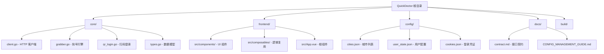

# QuickDoctor 项目文档

> 最后更新: 2026-01-27T23:51:59+08:00

## 变更记录 (Changelog)

- **2026-01-27**: 初始化项目架构文档，扫描覆盖率 85%

---

## 项目愿景

QuickDoctor 是一个基于 Go + Wails 的 Windows 桌面应用，用于自动化健康160平台的挂号预约。该项目提供微信扫码登录、号源查询与自动提交等核心功能，帮助用户快速预约医疗资源。

**核心价值**:
- 自动化抢号流程，提高预约成功率
- TLS 指纹客户端实现微信扫码登录
- 支持多医生、多日期、多时段的精细化配置
- 提交频率自动退避与代理支持
- 现代化前端界面（Vue 3 + TailwindCSS）

**技术栈**:
- 后端: Go 1.23 + Wails v2.11.0
- 前端: Vue 3 + Vite + TailwindCSS
- HTTP 客户端: bogdanfinn/tls-client（TLS 指纹绕过）
- 打包: Wails（跨平台桌面应用）

---

## 架构总览



---

## 模块索引

| 模块路径 | 职责 | 语言 | 入口文件 | 测试覆盖 |
|---------|------|------|---------|---------|
| **[/core](./core/CLAUDE.md)** | 核心业务逻辑（HTTP客户端、抢号引擎、登录） | Go | client.go, grabber.go | 无测试 |
| **[/frontend](./frontend/CLAUDE.md)** | Vue 3 前端界面 | JavaScript/Vue | src/main.js, src/App.vue | 无测试 |
| **/** | Wails 应用入口与配置 | Go | main.go, app.go | N/A |
| **/config** | 静态配置文件（城市、状态、Cookie） | JSON | cities.json | N/A |
| **/docs** | 接口契约与使用指南 | Markdown | contract.md | N/A |
| **/build** | 构建配置与资源 | 配置文件 | darwin/, windows/ | N/A |

---

## 运行与开发

### 前置条件
- Go 1.23+ (见 go.mod)
- Node.js 20+
- Wails CLI v2.11.0

### 安装 Wails CLI
```bash
go install github.com/wailsapp/wails/v2/cmd/wails@v2.11.0
```

### 本地开发（热重载）
```bash
wails dev
```

### 构建 Windows 可执行文件
```bash
wails build -platform windows/amd64
```

构建产物位于 `build/bin/`。

### 前端独立开发
```bash
cd frontend
npm install
npm run dev
```

---

## 测试策略

**当前状态**: 项目暂无自动化测试。

**建议补充**:
1. **后端单元测试**
   - `core/client_test.go`: HTTP 客户端 Mock 测试
   - `core/grabber_test.go`: 抢号逻辑边界测试
   - `core/qr_login_test.go`: 二维码登录流程测试

2. **前端组件测试**
   - 使用 Vitest + @vue/test-utils
   - 测试 composables 的状态管理逻辑
   - 测试关键 UI 组件的交互

3. **集成测试**
   - 测试 Wails 前后端事件通信
   - 模拟登录与抢号完整流程

---

## 编码规范

### Go 代码规范
- 遵循 `gofmt` 格式化
- 使用 `errors.New` 与 `fmt.Errorf` 包装错误
- 所有公开函数需有注释
- 避免全局变量，优先使用依赖注入

### JavaScript/Vue 规范
- 使用 Composition API (`<script setup>`)
- 组件命名使用 PascalCase
- Composables 命名使用 `use` 前缀
- TailwindCSS 类名按功能分组

### 命名约定
- Go 包名: 小写单词（如 `core`）
- Go 文件名: 蛇形命名（如 `qr_login.go`）
- Vue 组件: PascalCase（如 `AppShell.vue`）
- Composables: camelCase（如 `useAuth.js`）

---

## AI 使用指引

### 关键上下文优先级
1. **接口契约**: `docs/contract.md` - 前后端数据结构协议
2. **核心模块**: `core/client.go`, `core/grabber.go` - 业务核心
3. **前端入口**: `frontend/src/App.vue`, `frontend/src/composables/`
4. **配置管理**: `docs/CONFIG_MANAGEMENT_GUIDE.md`

### 常见任务快速导航
- **修改抢号逻辑**: 查看 `core/grabber.go`
- **调整 UI 布局**: 查看 `frontend/src/components/`
- **修改登录流程**: 查看 `core/qr_login.go`
- **添加新接口**: 更新 `app.go` 并绑定到 Wails
- **调试前后端通信**: 搜索 `runtime.EventsEmit` 和 `EventsOn`

### 修改注意事项
- **不要破坏接口契约**: 字段名与类型必须与 `contract.md` 一致
- **保持 Cookie 管理一致**: 所有 Cookie 操作统一使用 `core/cookies.go`
- **前端状态同步**: 使用 composables 管理状态，避免组件内部直接调用 Go 方法
- **错误处理**: 后端错误需包含足够上下文（如 `LastError()` 机制）

---

## 配置与数据

### 配置文件位置
- `config/cities.json`: 城市列表（静态）
- `config/user_state.json`: UI 配置与抢号参数（自动保存）
- `config/cookies.json`: 登录 Cookie（扫码后自动生成）
- `logs/`: 运行日志与提交响应调试文件

### 敏感数据
已忽略以下文件（见 `.gitignore`）:
- `config/cookies.json`
- `config/user_state.json`

---

## 部署与发布

### GitHub Actions 自动构建
- 触发条件: 推送 `v*` 标签或手动触发
- 构建平台: Windows (amd64)
- 工作流文件: `.github/workflows/build_windows.yml`
- 构建产物: `QuickDoctor-Win64.zip`（自动发布到 Releases）

### 手动打包
```bash
wails build -clean
cd build/bin
# 可执行文件为 wails.exe
```

---

## 免责声明

本软件仅供技术研究与学习使用，请勿用于非法用途或商业获利。使用本软件产生的任何后果由用户自行承担。
